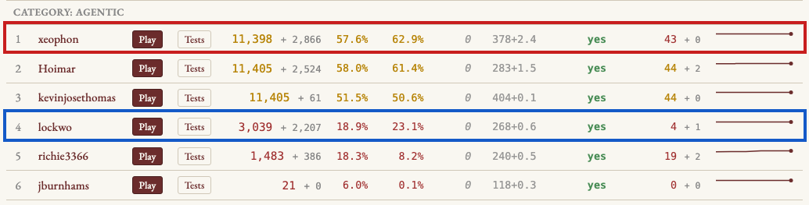

# Goodhart's Law and the Pony With No Name

*Draft for mazesofmenace.ai / davidbau.com. Alternate titles:
"Goodhart's Law and the Stone Golem"; "Densifying the Objective."
Pending permission and review from Owen Lockwood and Florian Brand,
whose public contest entries are analyzed below. All program output
is real, produced 2026-07-14 from their public repositories.*

The Teleport contest asks entrants to port NetHack 5.0 from C to
JavaScript so exactly that recorded play sessions replay bit for bit:
same random numbers drawn, same terminal screens painted. Forty-four
sessions are public. Forty-four more are held out. Here is the
leaderboard as I write, with the two entries this essay is about:



In this blog post I would like to examine and contrast two
contestants so far: **xeophon** (the agent deployed by
[Florian Brand](https://florianbrand.com/)), and **lockwo** (Owen
Lockwood's agent). The difference between the two can be seen in
session 0103, a short gameplay that both agents are able to reproduce
perfectly. That is, for every keystroke of input, both programs
produce exactly the same output on the screen, exactly matching the
original NetHack in C. The game even supplies its own soundtrack: a
few steps in, the message line reads, "You've been through the
dungeon on a pony with no name." Then the knight's pony meets a
kobold zombie:

<pre>
 <b>NetHack session 0103: Sir the Knight</b>

 The saddled pony bites the kobold zombie.  │  The kobold zombie is destroyed!
                                            │
      ---------------                       │       ---------------
      |.....@u......|                       │       |.....@.......|
      |...&lt;...Z.....|                       │       |...&lt;.u.......|
      |.............|                       │       |.............|
      ---.-----------                       │       ---.-----------
                                            │
  @  the knight     (60,2)   HP  4/16       │   @  the knight     (60,2)   HP  4/16
  u  saddled pony   (61,2)   HP  7/7        │   u  saddled pony   (60,3)   HP  7/8  ← grew
  Z  kobold zombie  (62,3)   HP  2/2        │   <s>Z  kobold zombie  (62,3)   HP  0/2</s>
</pre>

The `Z` disappears from the map and the pony steps forward,
identically in every world. Underneath each frame I have printed what
the game's memory holds at that moment — position and hit points for
the hero `@`, the pony `u`, and the zombie `Z` — using an instrument
I will describe shortly. None of those hit points appear anywhere on
the screen. Two things happen in NetHack when a pet makes a kill, and
neither of them touches the screen. The victim is struck from the
monster ledger — the crossed-out row is the zombie's entry at the
moment of removal, bitten down to 0 of its 2 hit points and taken
off the books. And the killer grows from the experience: the pony's
maximum hit points rise from 7 to 8. The original C NetHack does
both. **lockwo** does both also, matching the internals. But look at
what **xeophon** does:

<pre>
 <b>xeophon's port</b>

 The saddled pony bites the kobold zombie.  │  The kobold zombie is destroyed!
                                            │
      ---------------                       │       ---------------
      |.....@u......|                       │       |.....@.......|
      |...&lt;...Z.....|                       │       |...&lt;.u.......|
      |.............|                       │       |.............|
      ---.-----------                       │       ---.-----------
                                            │
  @  the knight     (60,2)   HP  4/16       │   @  the knight     (60,2)   HP  4/16
  u  saddled pony   (61,2)   HP  7/7        │   u  saddled pony   (60,3)   HP  <span style="color:#c00">7/7  ← never grows</span>
  Z  kobold zombie  (62,3)   HP  2/2        │   <s>Z  kobold zombie  (62,3)   HP  <span style="color:#c00">2/2</span></s>
</pre>

Look closely, because **xeophon** seems to get almost everything
right. The screens are identical: **xeophon** scores perfectly on
this game, matching every screen, so at this step the pony steps
and the zombie is eliminated, exactly as they should be. But look
at **xeophon**'s internal representation of the pony and the
zombie, and you will notice that the hit points are wrong. The
zombie took no damage before it was removed — it goes off the books
at 2/2, where the real one died at 0/2 — and the pony didn't grow
its additional maximum hit point. It is as if no combat occurred.

No screen in any session shows a monster's hit points, so no
channel the judge has can see either number. And mind the
scoreboard: **xeophon** passes this session perfectly, while
**lockwo**, which holds every one of these numbers true, *fails*
it — docked three screens of cosmetic display misses, 57 of 60.
The exam and the truth have parted company: the failing engine
keeps the truer world, and the perfect scorer is right on the
screen for the wrong reasons underneath. The wrongness simply
waits. A pony one hit point weaker than it should be is the kind of
thing you discover much later, in some other fight, as an
unexplainable desync.

That is what overfitting looks like in a deterministic program, at
the smallest possible scale: the visible world exactly right, the
hidden world quietly wrong, and the error parked precisely where the
scoring function cannot reach.

## Right for the wrong reasons

How does a program get the screen exactly right while getting the
world wrong? I went into **xeophon**'s source to see, and the answer is
a special case. In real NetHack the pony's kill is handled by the
same code that handles every monster killing every other monster;
the growth comes from a general function called `grow_up`. In
**xeophon**, when a pet's kill unfolds behind a `--More--`
prompt, the work is done by a hand-built state machine whose name
gives the story away:

```js
if (game._command_mode === 'ponyDamageMore') {
    ...
    d(1, 2);                        // the bite's damage dice — rolled, discarded
    rn2(3);
    rn2(6);
    rn2(3);                         // C's other rolls this turn — burned to match the count
    const messages = [`The ${targetName} is destroyed!`];
    ...
        rnd((data.mlevel ?? 0) + 1); // grow_up's roll — burned, growth never applied
        recordVanquished(target, false);
    ...
    game.level.monsters = (game.level?.monsters || []).filter(mon => mon !== target);
```

(The comments are mine; the code has none.) Each keystroke advances
a script that prints the right message and draws the right number of
random values, so the screen channel and the PRNG counter both stay
green. But the dice are rolled for their count, not their
consequences. The damage roll's result is thrown away — that is why
the zombie's hit points never move. The kill is an array filter, not
a death — that is why nothing that happens at a death, corpse,
growth, experience, happens here. The growth roll is burned with the
growth left unapplied — that is why the pony stays at 7. The engine
even contains a faithful port of `grow_up`, used on other paths;
this path declines to call it and just charges the dice. And the
whole machine is gated, one file over, on the condition

```js
if (mon.saddled && mon.data?.name === 'pony') {
```

— not "when a steed's kill resolves during message paging," but
literally *when a saddled pony does this*, because the only creature
that ever needed the path in the public sessions was this knight's
pony. This is what getting it right for the wrong reasons looks like
when you can read the source: the exam measures random numbers
consumed and screens drawn, so the program grew organs that consume
random numbers and draw screens, shaped around the individual
animals in the exam.

Where did this machine come from? I searched the repository's
history for the commit that created it. The first nineteen commits
are contest scaffolding; the twentieth, on May 20, is titled, in
full, "Port current JS behavior state" — a bulk import of thousands
of lines from work done outside version control — and
`ponyDamageMore` arrives inside it, fully formed. No subsequent
commit message among the 1,437 in the repository mentions a pony or
a pet's second attack again. The title deserves a second reading:
not port the behavior — port the behavior *state*. Whatever
deliberation produced the pony machine happened off the books, and
nothing on the record ever found a reason to revisit it, because
nothing in the exam ever would.

Now look at the same event in **lockwo** — the engine that fails
this session. Its combat code lives in a file named `mhitm.js`,
after `mhitm.c`, the C file it ports, and it begins by declaring its
own limits:

```js
// SCOPE: the contest gameplay sessions only exercise hand-to-hand physical
// attacks (AT_BITE / AT_CLAW / AT_KICK / AT_WEAP, AD_PHYS) between low-level
// dungeon monsters and the starting pet (kitten / little dog / pony).  Those
// paths are implemented call-for-call so the rn2/rnd/d stream matches C
// exactly (verified against seed0060's recorded trace at calls 2409..2443):
// ...
// Non-physical adtyps, gaze/engulf/explode/breath attacks, multi-attack
// monsters beyond the pony, and weapon-wielding monster attackers are NOT
// modeled here; if such a combat is ever reached, mattackm() returns MISS
// WITHOUT consuming any RNG (so it can never silently desync the stream — it
// would instead surface as a clean divergence to be ported next).
```

Read that last parenthesis twice. Both engines are incomplete; every
port is. When **xeophon** meets something it has not truly
implemented, it burns the right number of random values so that the
gap cannot show. When **lockwo** meets something it has not
implemented, it deliberately consumes nothing, so that the gap
*must* show — a loud, clean failure at a known frontier, queued up
as the next thing to port. One design hides its ignorance from the
exam; the other converts the exam into a map of its ignorance.

And where **xeophon**'s pony path burns the dice, **lockwo** spends
them on what they mean:

```js
    mdef.mhp -= damage;
    if (mdef.mhp < 1) {
        ...
        // monster killed (monkilled -> mondied -> corpse_chance, then grow_up).
        killMonster(mdef, defCd);
        const grew = grow_up(magr, mdef, agrCd, defCd);
        return M_ATTK_DEF_DIED | (grew ? 0 : M_ATTK_AGR_DIED);
    }

function grow_up(magr, mdef, agrCd, defCd) {
    ...
    // max_increase = rnd(victim->m_lev + 1)              (makemon.c:2095)
    const max_increase = rnd(victimLev + 1);
    // cur_increase = (max_increase > 1) ? rn2(max_increase) : 0
    const cur_increase = (max_increase > 1) ? rn2(max_increase) : 0;
    ...
    if (magr.mhpmax != null) magr.mhpmax += max_increase;
    if (magr.mhp != null) magr.mhp += cur_increase;
    ...
}
```

The same dice, the same count — the PRNG channel cannot tell these
two programs apart. But here the damage roll damages, the kill
kills, and the growth roll grows the pony: 7 becomes 8 in a ledger
no screen will ever print, because the roll's *meaning* was ported,
not just its cost. Nearly every draw in the file carries a citation
to the C line it mirrors. That is why, on this session, the failing
engine is the one holding the true world: its author spent the dice
on the world, and took the three cosmetic screen misses as the price
of not pretending.

And `mhitm.js` has a birth certificate. The commit that creates it,
on June 1, is titled "steed mount_steed (knight rides pony) +
pet-melee/naming foundation -> 456," and its body reads like a lab
notebook: "mhitm.js (new) + dogmove/monmove: monster/pet melee
(mattackm) — advances seed0060's pet-attack RNG"; "rebuilt
MMOVE_BY_PMIDX base-speed table by-name vs the recorder's monsters.h
(119 wrong entries fixed)"; "Public screens 442 -> 456 (+14). No
regressions." Two agents, two kinds of memory. One records what it
did to the world it was building, in units of the world; the other
records that a state had been reached, in units of the score.

## The grid bug

Hit points are numbers, and numbers must be talked about. Positions
can be drawn. To draw one, I ran a small experiment: I took the exact
keystrokes of a public session, changed nothing but the dungeon seed,
and recorded fresh ground truth from the original C program. A
held-out session, one seed away from the exam, that no engine had
ever seen. Then I ran both engines through it and compared their
hidden worlds against C's, keystroke by keystroke.

Here is the hero's situation, forty keystrokes in: a tourist standing
in his starting room with his kitten, the rest of the level dark.

```
1. THE HERO'S VIEW:

    ┌───┐
    │·@f│
    │··F│
    │···│
    │···│
    │···
    └───┘
```

Fifty-eight columns to the east, out in that darkness, lives a grid
bug, the little `x` that is NetHack's joke monster: it can only step
north, south, east, or west, because it lives on a grid. Here is
where each world believes it to be:

```
2. IN C'S WORLD — AND IN LOCKWO'S ENGINE, SQUARE FOR SQUARE:

    ┌───┐
    │·@f│
    │··F│
    │···│                                                       x   ◄
    │···│
    │···
    └───┘

3. IN XEOPHON'S ENGINE:

    ┌───┐
    │·@f│
    │··F│
    │···│                                                    x      ◄
    │···│
    │···
    └───┘
```

Three squares apart, and it stays that way for sixty consecutive
keystrokes while the hero putters around his room on the other side
of the world. At this boundary **lockwo** has consumed exactly the
random draws C has, and holds the bug on exactly C's square; it keeps
holding it, square for square, even when C's bug finally scuttles off
to a new corner and **lockwo**'s follows it move for move.
**xeophon**'s bug sits parked at its wrong post the whole time. The top engine on the leaderboard has a grid bug: an off-by-one
in the grid, in the dark, on ground it never memorized. The
fourth-place engine, on the same fresh ground, is exact.

It is worth understanding how an engine gets into this condition,
because nobody hardcoded anything.

## How a perfect score goes hollow

Think of a judged session as a system of equations. The recorded
trajectory supplies one equation for every fact it actually consults:
every random draw, every painted cell. **xeophon** satisfies all of
them, and that took real mechanism; Florian's repository documents 925
source-cited porting "slices," each faithfully implementing the exact
behavior some public session step exercises. But the game's state
space holds vastly more unknowns than one trajectory consults, and
every unconsulted fact is a free variable. It can take any value
while the residuals stay zero. The pony's growth is a free variable.
So is the zombie's burial date.

The deeper into the dungeon you look, the bigger the free variables
get. In session seed4500 the tour descends into Gehennom, where the
level generator makes 3,147 draws in a single step, identically in
both engines, and Owen's instrument reports of **xeophon**:

```
  MON stone golem#903 (m_id 903) . mhp :   C=100   JS=18
```

A stone golem with eighteen hit points instead of one hundred, in
hell, inside a perfect score. NetHack assigns golem hit points
without rolling dice, so no random number ever betrayed it. And the
same instrument, swept across all forty-four public sessions, finds
the pattern everywhere the trajectories didn't reach: in the Castle
of session seed0360, behind a door the hero never opens, an entire
rank of the garrison has stood one square west of its true position
since the moment the level was generated:

```
   C's castle barracks:      ssSSSLSSS
   the engine's barracks:    sSSSLSSS·      (whole rank slid west)
```

How can a monster stand in the wrong place without disturbing the
random stream? Because the dice choose from a menu. When the game
moves or places a monster, the code first builds a list of legal
squares, then a roll picks from the list. The judge records the roll,
`rn2(8)=3`; it does not record the list. Two engines can agree on
every roll, byte for byte, while disagreeing about what item three
is. Same dice, different dish. That is also the one loophole in an
otherwise remarkable property of this contest's PRNG channel, which
pins nearly everything that rolls. What never rolls at all — growth,
burials, assigned hit points, timers, ledgers — is entirely free.

None of this required bad faith, and that is Goodhart's law in its
classic form: when a measure becomes a target, it ceases to be a good
measure. The law's favorite parable, probably apocryphal, is the
colonial bounty paid on dead cobras, which taught the citizens of
Delhi to farm cobras. An optimizer aimed at a proxy will satisfy the
proxy; agents are exceptional optimizers; and the errors that survive
are, by natural selection, exactly the ones the proxy cannot see.
The bounty here was paid on matching screens, and the dungeon bred
its cobras in the dark.

## The two prompts

The interesting question is not who worked harder. **xeophon** was
built by a Codex agent loop that ran around the clock for three
weeks, 1,417 commits authored literally by `Codex <codex@local>`; his
repository description is the whole story in advance, crying emoji
his: "Hill climbing model is lost when first hill is indeed climbed
😢". The interesting question is what each one's agents were told to
optimize. Florian's standing orders are, on
their face, exactly right. From his committed `PORTING_PLAN.md`:

> Public session fixtures are regression tests only; they must not be
> embedded into runtime behavior... Justify behavior with upstream C
> references... Do not hardcode seeds, player names, move counts,
> screen snapshots, cursor traces, or fixture-specific RNG answers.
> After code changes, run focused checks, public tests, and
> `npm run score`.

No hardcoding, cite the C source, and the final tree honors this. But
the loop's unit of work became the observed behavior: make the next
divergent step of the next public session match, then write the slice
down. Nine hundred twenty-five slices later, the engine is a cast of
the fixtures: exact wherever the exam measured, free everywhere else.

Owen's orchestration prompt is also public, in the commit message
that launched his agent swarm:

> pick-target.mjs ranks sessions by "closest to passing" and emits a
> porter-task spec containing the failing session, the divergent
> call, **the enclosing C function, and a C source slice** ...
> verify-and-merge.mjs is the merge gate — accepts only when the run
> strictly improves total screens and zero sessions regress.
>
> The 44 public sessions diverge at only **8 distinct C call-sites**;
> place_level (dungeon.c:687) alone blocks 20 sessions and role_init
> (role.c:2060) blocks 10 more.

Read them side by side. Both cite C. Both forbid hardcoding. The
difference is the unit of work handed to the agent: Florian's loop
worked on observed behaviors; Owen's worked on causal functions, and
his opening triage computed that all 44 failures shared just 8 root
causes before porting anything. Same score, same rules, opposite
geometry. One process fits the manifold. The other reconstructs the
machine — more slowly, which is why his public score is modest, but
with a property the perfect score lacks: on every session **lockwo**
matches, its hidden ledgers match too. **lockwo** knows less, and
nothing it knows is wrong.

## The instrument

Owen also built the thing this essay has been using all along. On his
last day of activity, after a month of diagnosing divergences by
hand, he spent one afternoon automating himself: a differential state
oracle, `oracle.mjs`, 489 lines.

The idea: the judged channels are a thin projection of the game.
Behind them is the latent state, the hidden truth of the simulation:
every monster's position, hit points, tameness, fear; the hero's
condition; the timers. Owen patched the contest's C recorder to dump,
at every keystroke boundary, one JSON line with the hero's state and
the complete monster ledger. He added a mirrored dump to his JS
engine, gated behind an environment variable and verified
byte-identical off, so the judged run is untouched. His comparator
aligns the two streams and reports the first disagreement: which
step, which entity, which field, both values.

Then the clever join. A state snapshot cannot know which code wrote
it. But each snapshot carries one extra integer, the cumulative count
of random draws, and the contest's recordings label every draw with
its C call site. So when a fact goes wrong, the oracle slices the
labeled stream to that boundary and prints the C functions that were
executing. The state channel finds the wrong fact; the RNG channel
names the suspect; the join costs one integer per row.

**lockwo** has the same disease, and this is the point. In session
seed4500, a knight fights a cobra beside the Oracle of Delphi, and
Owen's own **lockwo** moves the snake through the statues on the
wrong path. Here is what happens when the failure is yours and the
instrument is running:

```
  ── FIRST DIVERGENCE ──
  step 261   C-rng#=8124  JS-rng#=8124  canon-cum-rng#=8124
  MON cobra#111 (m_id 111) . mx :   C=39   JS=37
  ➜ FIX: m_id 111 moved to wrong cell — m_move/mfndpos at distfleeck (monmove.c:538)
```

Same draw counts on both sides, a snake one menu-item astray, caught
at the boundary it happened, with the C function to fix printed at
the end of the line. The FIX comes from nine little rules mapping
fields to subsystems; nine suffice because the schema did the hard
work of choosing which nineteen latent fields matter. Note the
asymmetry with everything above. Both engines err the same way. But
Owen's error prints itself and enters his work queue. The pony that
never grows sits under a perfect score, congratulated by every green
light its owner installed. The instrument tells the truth about
everyone, including its maker — it is this same oracle, pointed at
**xeophon** through a 76-line adapter, that found the pony, the
zombie, the golem, and the garrison.

## Telemetry's missing verse

Every senior engineer preaches telemetry: you cannot fix what you
cannot see; log at the boundaries; keep traces, metrics, and logs.
The sermon is correct, and it is about visibility. What this contest
teaches is one verse sharper:

Telemetry is most powerful when it records latent state against an
opinion of what that state should be, and flags the first
disagreement.

Do not just log that the pony fought. Log the pony's maximum hit
points, every turn, and diff them against intent. Owen's oracle flags
the missing growth at the moment of the kill, while it is still just
a wrong number in a ledger, long before it can bend a draw or touch a
pixel. The alternative is what everyone lives instead: wait until the
hidden wrongness finally interacts with something visible, then begin
the archaeology ten thousand events downstream of the cause.

And almost anything can be logged as a latent event: the moment a
shopkeeper's ledger gains a debt, the tick when meat begins to rot,
the burial of a zombie. One of these sessions contains the message
"The gnome picks up a blue gem" — and picking up a gem consumes no
random number at all, so every unseen gnome pocketing an unseen gem
is a world-change only a latent event log can witness.

## Making hidden state visible

There is a philosophy underneath this that I think about constantly,
because it is my day job from the other side. I spend my research
life trying to interpret the hidden states of neural networks, and it
is hard: a language model carries an enormous latent state that
nobody designed, that resists decoding, about which it is genuinely
difficult to assert what any piece should be. A great deal of AI
safety research is the struggle to make such hidden states visible
and checkable at all.

Traditional software is the blessed case, and we forget to be
grateful. A deterministic program can hold state of staggering
complexity — NetHack's dungeon holds thousands of latent facts — but
every one of those facts was designed by someone, has a name, and
admits an opinion about what it should be. The pony's `mhpmax` is not
a mysterious activation. It is a field, and the C source says it
should be 8. Software is the one place where the hidden state of a
vastly complex system is interpretable by construction. Declining to
look at it is a choice.

The requirement is the one Owen's schema demonstrates: know what your
hidden states are, and hold an opinion about what they should be. His
nineteen fields are a theory of which latent facts matter; the C
recording is his opinion of their correct values; the oracle is just
the diff. The middle part, the opinion, is what the standard
telemetry sermon forgets.

And this is the general defense against Goodhart's law. If a team of
optimizers, human or agentic, will hill-climb whatever metric you
post, the metric must be too dense to climb dishonestly. There is a
nice analogy in machine learning itself: a generative model, forced
to predict every pixel of the dog, learns what dogs look like, while
a classifier asked only to say dog-or-cat learns shortcuts. Dense
targets are hard to game because they leave few free variables. A
test that checks one output leaves your agents a manifold of hollow
golems and ungrown ponies; a log that asserts every latent event
leaves them nowhere to stand except correctness.

Florian's epitaph says the hill-climbing model is lost now that the
first hill is climbed, and as epitaphs go it is unusually precise.
But the model is not lost. The hill was only the public suite, the
map is enormously bigger than the hill, the recorder that draws new
maps ships in every fork, and the instrument that reads them is
sitting, finished, in fourth place: Owen's oracle prints its campaign
map of all 44 sessions in one command, and every line of it names the
next C function to fix. I suspect the leaderboard has not heard the
last of either of them.
