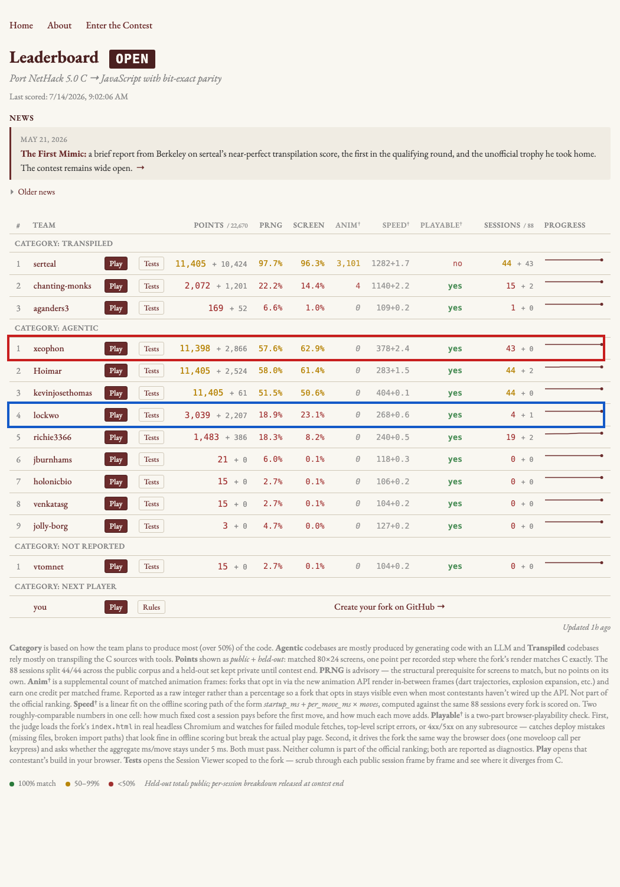

# Goodhart's Law and the Stone Golem

*Draft for mazesofmenace.ai / davidbau.com. Pending permission and
review from Owen Lockwood and Florian Brand, whose public contest
entries are analyzed below. All program output is real, produced
2026-07-14 from their public repositories.*

Charles Goodhart was a Bank of England adviser who noticed, in 1975,
that the act of measuring had broken his measurements. The Bank had
found statistical regularities in the money supply and began steering
policy by them, and the regularities promptly dissolved. His original
phrasing was bone-dry: any observed statistical regularity will tend
to collapse once pressure is placed upon it for control purposes. The
version everyone quotes came later, from the anthropologist Marilyn
Strathern: when a measure becomes a target, it ceases to be a good
measure.

The law's favorite parable, probably apocryphal but too good to
retire, is the cobra bounty: a colonial administration in Delhi,
plagued by snakes, pays for dead cobras, and the citizens respond by
farming cobras. (The attested version happened in Hanoi in 1902 with
rat tails; the rats came out ahead.) Ever since, Goodhart's law has
been a lesson about managing people: pay for lines of code and you
get lines of code, pay for closed tickets and you get closed tickets,
test schools on a metric and the schools teach the metric. Machine
learning people know the same law by a different name. Overfitting is
Goodhart's law with the manager replaced by gradient descent: optimize
a model against its training measure hard enough and the measure
detaches from the thing you meant.

Here is what has changed, and why I keep returning to this law. With
LLM coding agents, every programmer is now a manager. Your agents are
brilliant, tireless subordinates who will optimize whatever number you
put in front of them, and they respond to incentives with a purity no
human team ever achieved. Goodhart's law is no longer a lesson for
executives. It is a daily operating condition of software
engineering, and it is one of the central things my porting contest
turned out to measure.

## Two entries

The Teleport contest asks entrants to port NetHack 5.0 from C to
JavaScript so exactly that recorded play sessions replay bit for bit:
same random numbers drawn, same terminal screens painted. Forty-four
sessions are public. Forty-four more are held out. Here is the
leaderboard as I write, with the two entries this essay is about:



The red box is the top entry in the agentic category: Florian Brand,
who by day evaluates language models professionally. His engine was
built by a Codex agent loop that ran around the clock for three
weeks, 1,417 commits authored literally by `Codex <codex@local>`. It
scores 11,398 of a possible 11,405 public points, and 2,866 of
11,265 held out. His repository description is the whole story in
advance, crying emoji his:

> Hill climbing model is lost when first hill is indeed climbed 😢

The blue box, down in fourth place, is Owen Lockwood, who by day
builds probabilistic computing hardware. His engine passes 4 of 44
public sessions. I am going to argue that his entry contains the most
important artifact on the board.

## The hollow golem

I wanted to show you a particular kind of failure: a session where an
engine paints every screen exactly right while, somewhere out of
sight, the world has quietly gone wrong. My first idea was a monster
walking the wrong way in the dark. It turns out that in this contest
that exact thing almost cannot happen, for a reason worth
understanding, so let me show you what happens instead.

Meet session seed4500, a knight touring the dungeon for 1,813
keystrokes. On level 5 he blunders into a brawl beside the Oracle's
chamber, a cobra and an earth elemental at once, among the Oracle's
centaur statues:

```
You hit it.  The earth elemental hits!  The cobra bites!

                                 ┌───────────┐
                                 │C@········C│
                                 │·ES··C·····│
                                 │···┌─ ─┐  ··
                                 │···│       │
                                 │··C│
                                 │···│
                                 │···└
                                 │·····
                                 │C······
                                 └────────

Wizard the Knight              St:18/01 Dx:9 Co:12 In:7 Wi:14 Ch:17 Lawful
Dlvl:5 $:0 HP:54(80) Pw:128(128) AC:3 Xp:15/160000 T:57
```

He wins, badly hurt, kneels, and prays to Lugh; the cobra slithers
under a statue while he is helpless; Lugh is pleased. Then he
descends, far, until the game murmurs that you hear groans and moans
everywhere. He has entered Gehennom. The game generates hell around
him, 3,147 random draws in a single step, and Florian's engine makes
every one of those draws identically to the original C. On this
session Florian's engine is perfect: all 108,275 random numbers, all
1,814 screens.

And in that freshly generated hell, in Florian's engine, stands a
stone golem with these properties, printed by an instrument we will
get to shortly:

```
  MON stone golem#903 (m_id 903) . mhp :   C=100   JS=18
```

A stone golem with eighteen hit points instead of one hundred.
NetHack assigns golems their hit points; it does not roll dice for
them, so no random number ever betrayed the difference, and no screen
displays a monster's health. Every channel the judge checks is green.
The golem is simply hollow. The first time any trajectory actually
fights it, it will die five times too early and everything downstream
will desync.

This is also why my wandering-monster example was hard to find, and
the reason is nearly a theorem about this contest's design. Monster
movement consumes random numbers, so under a judge that checks the
PRNG stream, a monster usually cannot walk the wrong way without the
stream betraying it. The random-number channel pins most of what
rolls dice. What it cannot pin is what never rolls: assigned hit
points, dispositions, timers, bookkeeping. In an ordinary software
project, where the tests check outputs only, the wandering unseen
monster is everywhere. Here the wrongness was squeezed into the
places the stream cannot see, and it chose the golem's chest cavity.
(A second find in the same session: during the knight's prayer, the C
engine knows the hero is helpless for three turns, `multi = -3`.
Florian's engine produces the same numbers while not knowing the
knight is praying.)

I said "nearly" a theorem, because there is one loophole, and once I
understood it I went hunting through all forty-four sessions for what
it might have let survive. What I found is the best illustration in
this essay.

## The garrison in the dark

Here is how the dice actually move a monster. First the code builds a
menu: it scans the neighboring squares in a fixed order and collects
the legal ones into a list, legality decided by dozens of small rules
about walls, doors, water, and who stands where. Then a roll picks
from the menu. The judged channel records the roll, `rn2(8)=3`. It
does not record the menu. So two engines can agree on every roll,
argument and result, byte for byte, while disagreeing about what item
number three *is*, because one engine's rules built the list with a
different square in that slot. Same dice, different dish. If the
menus differ in length the argument changes and the stream betrays it
instantly; the surviving form of the bug is an equal-length menu with
different contents. And the same trick applies before any monster
takes a step, when a freshly generated level *places* its inhabitants:
same rolls, different placement grid.

Now watch it happen. Public session seed0360 is a grand tour: a
sorcerer in debug mode teleporting level to level through the whole
dungeon. Florian's engine scores it perfectly. On dungeon level 25,
the Castle, the hero materializes at the western edge, and this,
byte-identical in both engines, is everything he and the judge will
ever see of that level:

```
1. WHAT THE HERO AND THE JUDGE SEE (byte-identical in both engines):

    ·│·
    ·@l 1    2

      2 4

    3

      2
```

A pool of torchlight and four remembered map symbols. Now the same
map with the latent state revealed. The Castle keeps a garrison, and
at this boundary both engines have drawn exactly 22,810 random
numbers:

```
2. THE SAME MAP, C'S HIDDEN GARRISON REVEALED
   (S soldier, s sergeant, L lieutenant, C captain):

    ·│·
    ·@l 1    2S S
    ·──
                    S S    SSSsSSSSs        ◄
      2 4          S   S   SSssSSSCS        ◄

    3               L
                   S   S   ssSSSLSSS        ◄
      2             S S    SSSSSSsss        ◄

              S S

3. THE GARRISON AS THE PERFECT-SCORING ENGINE BELIEVES IT:

    ·│·
    ·@l 1    2S S
    ·──
                    S S    SSSsSSSSss       ◄
      2 4          S   S   SSssSSSCSS       ◄

    3               L
                   S   S   sSSSLSSS         ◄
      2             S S    SSSSSsss         ◄

              S S
```

Look at the marked ranks. In the perfect-scoring engine, an entire
rank of the Castle garrison stands one square west of where it stands
in C; a sergeant and a soldier have traded places; the barracks
formation is subtly, permanently wrong. The armies have differed
since the moment the level was generated, they differ through both of
the tour's visits to the Castle, the random streams agree to the
draw throughout, and the hero never opens the barracks door. Nothing
the judge measures can ever know. The soldiers sleep, drawing no
dice, waiting for a fight that this session never brings, and if it
ever came, everything after would unravel.

One comic footnote from the same hunt, in the same engine, on another
perfectly scored session: a kobold zombie is bitten by the hero's
pony, and the screen, in both worlds, announces "The kobold zombie is
destroyed!" C buries it on the spot. Florian's monster ledger keeps
it on the books, hit points intact, officially alive, for a dozen
more turns before it quietly vanishes. His engine reported the
zombie's death; the zombie was never informed.

## How the perfect score was actually earned

You may reasonably ask how 108,275 exactly matched random numbers can
coexist with a hollow golem. The answer is that the perfect score is
real, and local. Think of the session as a system of equations: the
trajectory supplies one equation for every fact it consults, and
Florian's engine satisfies every one of them exactly. But the game's
state space holds vastly more unknowns than one trajectory consults,
and every unconsulted fact is a free variable. It can take any value
while the residuals stay zero. The golem's hit points are a free
variable on this path. The engine is a surface fitted through 44
recorded trajectories, exact at every point it was fitted to,
unconstrained in between.

How it got that way is documented, meticulously, in Florian's own
repository, and I want to be clear that nothing here was done in bad
faith. His agent's standing orders are, on their face, exactly right.
From his committed `PORTING_PLAN.md`:

> Public session fixtures are regression tests only; they must not be
> embedded into runtime behavior or used to infer hidden tests. ...
> Justify behavior with upstream C references or existing JS
> compatibility constraints. ... Do not hardcode seeds, player names,
> move counts, screen snapshots, cursor traces, or fixture-specific
> RNG answers. After code changes, run focused checks, public tests,
> and `npm run score`.

No hardcoding, cite the C source, and the final tree honors this: it
greps clean of seeds and replay tables. But watch what the loop's
unit of work became. The plan's own completed-work list reads:
"centaur/slithy boot fallout, horned helmet fallout, forced fedora
luck removal, silver reflection-off fallout, slow-digestion
digest-combat regurgitation..." Each entry is one of 925 audit
"slices," and each slice is a scenario: the exact configuration some
public session step exercises, ported faithfully, with citations,
and verified by `npm run score`. One slice's own fine print gives the
game away: "This still uses targeted local body-shape predicates
rather than a generated C monster-shape table." Where the original
has a general table consulted by general logic, this engine has an
enumeration of the cases the fixtures visited. There is even a state
variable in the engine named
`_deferred_straw_golem_second_hit_after_topline`: control flow
stitched to one monster's attack timing relative to one interface
message. A straw golem in the logic, a hollow stone golem in the
data.

Nobody chose this. The objective function chose the decomposition.
An agent whose progress signal is "make the next divergent draw
match" will decompose the port into fixture-shaped slices no matter
how honestly each slice consults the source. That is Goodhart's law
operating below the level of intent, and it is the version every
engineering manager should study, because your agents will do exactly
this to your test suite while following every rule you wrote.

## The other prompt

Owen Lockwood's loop had the same score available, the same C source,
and a similar ban on hardcoding. His orchestration prompt is
effectively public, because he wrote it into the commit message that
launched his agent swarm:

> pick-target.mjs ranks sessions by "closest to passing" and emits a
> porter-task spec containing the failing session, the divergent
> call, **the enclosing C function, and a C source slice** ...
> verify-and-merge.mjs is the merge gate — accepts only when the run
> strictly improves total screens and zero sessions regress.
>
> The 44 public sessions diverge at only **8 distinct C call-sites**;
> place_level (dungeon.c:687) alone blocks 20 sessions and role_init
> (role.c:2060) blocks 10 more.

Read those two prompts side by side and the difference is not
ethics. Both cite C. Both forbid hardcoding. The difference is the
unit of work handed to the agent. Florian's loop worked on *observed
behaviors*: make this step of this session match. Owen's loop worked
on *causal functions*: here is the C function implicated, port it.
And his opening triage is the tell of a different mind: before
porting anything, he computed that all 44 failing sessions shared
just 8 root causes, and aimed at the function that unblocked 20
sessions at once. Same signal, same rules, opposite geometry. One
process fits the manifold; the other reconstructs the machine.

Owen's engine is less complete, which is why his public score is
modest. But it has a property Florian's cannot have: no gap. Measured
on a fresh session that did not exist this morning (I re-recorded a
public session's recipe with the seed changed by one), Florian's
perfect engine and Owen's 4-of-44 engine converge to nearly the same
number, about 7 to 8 percent of the random stream, except Owen scores
the same 7.6 percent on the exam he could have memorized. His engine
contains only things it believes for a reason.

## The instrument

And Owen built something more important than his engine. On his last
day of activity, June 23, after a month of diagnosing divergences by
hand, he spent one afternoon automating himself: a differential state
oracle, `oracle.mjs`, 489 lines.

The idea: the judged channels, random numbers and screens, are a thin
projection of the game. Behind them is the latent state, the hidden
truth of the simulation: every monster's position, hit points,
tameness, fear, the hero's condition, the timers. Owen patched the
contest's C recorder to dump, at every input boundary, one JSON line
with the hero's state and the complete monster chain. He added a
mirrored dump to his JS engine, gated behind an environment variable
and verified byte-identical off, so the judged run is untouched. His
comparator aligns the two streams keystroke by keystroke and reports
the first disagreement: which step, which entity, which field, both
values.

Then the clever join. A state snapshot cannot know which code wrote
it; by the time state is dumped, the writers are gone. But each
snapshot carries one extra integer, the cumulative count of random
draws, and the contest's recordings already label every draw with its
C call site. So when a fact goes wrong, the oracle slices the labeled
draw stream to that boundary and prints the C functions that were
executing. The state channel finds the wrong fact; the RNG channel
names the suspect; the join costs one integer per row. Its report on
his own engine, at the Delphi fight, is what a diagnosis should look
like:

```
  ── FIRST DIVERGENCE ──
  step 261   C-rng#=8124  JS-rng#=8124  canon-cum-rng#=8124
  MON cobra#111 (m_id 111) . mx :   C=39   JS=37
  ➜ FIX: m_id 111 moved to wrong cell — m_move/mfndpos at distfleeck (monmove.c:538)
```

That is the menu loophole again, caught in the act, in the maker's
own engine, and this time you can see it, because this cobra is the
one from the fight at the Oracle of Delphi. Side by side, the same
moment in the two worlds:

```
   THE ORACLE'S COURTYARD (C)     THE SAME MOMENT (OWEN'S ENGINE)

      ┌───────────┐                  ┌───────────┐
      │C···S·····C│                  │C·········C│    ◄
      │·····C·····│                  │··S··C·····│    ◄
      │··E┌─ ─┐                      │··E┌─ ─┐
      │@··│                          │@··│
      │··C│                          │··C│
      │···│                          │···│
```

The snake is approaching the knight along a different path through
the Oracle's statues, caught at the boundary where it happened, while
the random streams still agree perfectly, with the function to fix
named at the end of the report. The FIX line comes from nine little
rules mapping fields to subsystems, a thirty-line function, and the
reason nine rules suffice is that the schema did the hard work:
choose the right nineteen latent fields and they group themselves by
the subsystem that writes them. Note what is different about this
failure and the garrison's. Both engines err the same way. But
Owen's error prints itself, names its C function, and enters his
work queue; the garrison's error sits under a perfect score,
congratulated by every green light its owner installed. The
instrument tells the truth about everyone, including its maker. It
was this same oracle, pointed at Florian's engine with a 76-line
adapter, that found the hollow golem, the unfelt prayer, and the
garrison in the dark.

## Telemetry, the standard sermon, and the missing verse

Every senior engineer preaches telemetry. You cannot fix what you
cannot see; log at the boundaries; emit structured events; keep
traces, metrics, and logs; watch the golden signals. The sermon is
correct and I have given it myself. But the standard version is about
*visibility*, watching what the system does, and it usually stops
there. What this contest teaches is a sharper doctrine:

Telemetry is most powerful when it records latent state against an
opinion of what that state should be, and flags the first
disagreement.

Concretely: do not just log that a monster moved. Log every monster's
position, every turn, including the ones the hero cannot see, and
diff the log against intent. Owen's oracle flags the cobra at the
boundary its coordinate first goes wrong, while it is still just a
wrong number in the dark, long before it can bend a random draw or
touch a pixel. It flags the golem's hit points at creation, in a
session where they will never matter, a session the judge scores
perfect. The alternative is what everyone lives instead: wait until
the hidden wrongness finally interacts with something visible, then
begin the archaeology ten thousand events downstream of the cause.

And monster positions are only the beginning. Almost any action in
the game could be logged as a latent event: the moment a shopkeeper's
ledger gains a debt, the tick when a lump of meat begins to rot, the
instant a prayer sets `multi = -3`. One of these sessions contains
the message "The gnome picks up a blue gem" — and picking up a gem
consumes no random number at all, so every unseen gnome pocketing an
unseen gem is a world-change only a latent event log can witness. Each such event is a fact the
screen does not show and a place where two implementations can
disagree invisibly. Every one you log converts a class of silent
divergence into a loud one.

## Making hidden state visible

There is a philosophy underneath this that I think about constantly,
because it is my day job from the other side. I spend my research
life trying to interpret the hidden states of neural networks, and it
is hard: a language model carries an enormous latent state that
nobody designed, that resists decoding, about which it is genuinely
difficult to assert what any piece *should* be. A great deal of AI
safety research is the struggle to make such hidden states visible
and checkable at all.

Traditional software is the blessed case, and we forget to be
grateful. A deterministic program can hold state of staggering
complexity, NetHack's dungeon holds thousands of latent facts, but
every one of those facts was designed by someone, has a name, and
admits an opinion about what it should be. The golem's `mhp` is not a
mysterious activation. It is a field, and the C source says it should
be 100. Software is the one place where the hidden state of a vastly
complex system is interpretable by construction. Declining to look at
it is a choice.

The first key, though, is exactly the one Owen's schema demonstrates:
you must know what your hidden states are, and you must have an
opinion about what they should be. His nineteen fields are a theory
of which latent facts matter. The C recording is his opinion of their
correct values. The oracle is just the diff. All three parts are
required, and the middle one, the opinion, is the part the standard
telemetry sermon forgets.

And this, finally, is the general defense against Goodhart. If a team
of optimizers, human or agentic, will hill-climb whatever metric you
post, then the metric must be too dense to climb dishonestly. Include
every detail. There is a nice analogy in machine learning itself:
a generative image model, forced to predict every pixel of the dog,
learns what dogs look like, while a classifier asked only to say dog
or cat learns shortcuts, textures, backgrounds, whatever separates
its training set. Dense targets are hard to game precisely because
they leave few free variables. A test that checks one output leaves
your agents a manifold of hollow golems; a log that asserts every
latent event leaves them nowhere to stand except correctness.

The contest's held-out sessions revealed the gap. Only denser ground
truth removes it. Florian's epitaph says the hill-climbing model is
lost now that the first hill is climbed, and as epitaphs go it is
unusually precise. But the model is not lost. The hill was only the
public suite, the map is enormously bigger than the hill, the
recorder that draws new maps ships in every fork, and the instrument
that reads them is sitting, finished, in fourth place: Owen's oracle
prints its campaign map of all 44 sessions in one command, and every
line names the next function to fix. I suspect the leaderboard has
not heard the last of either of them.
