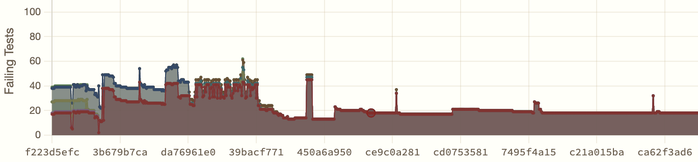
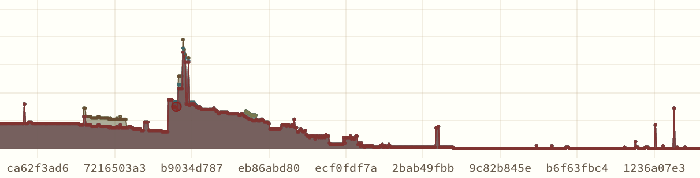
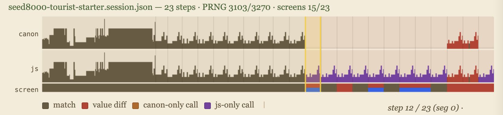
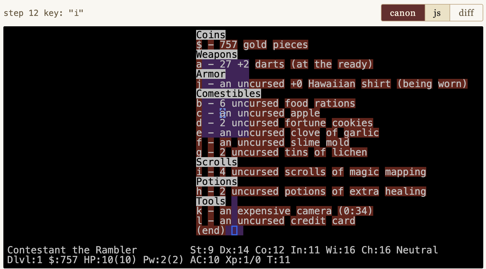
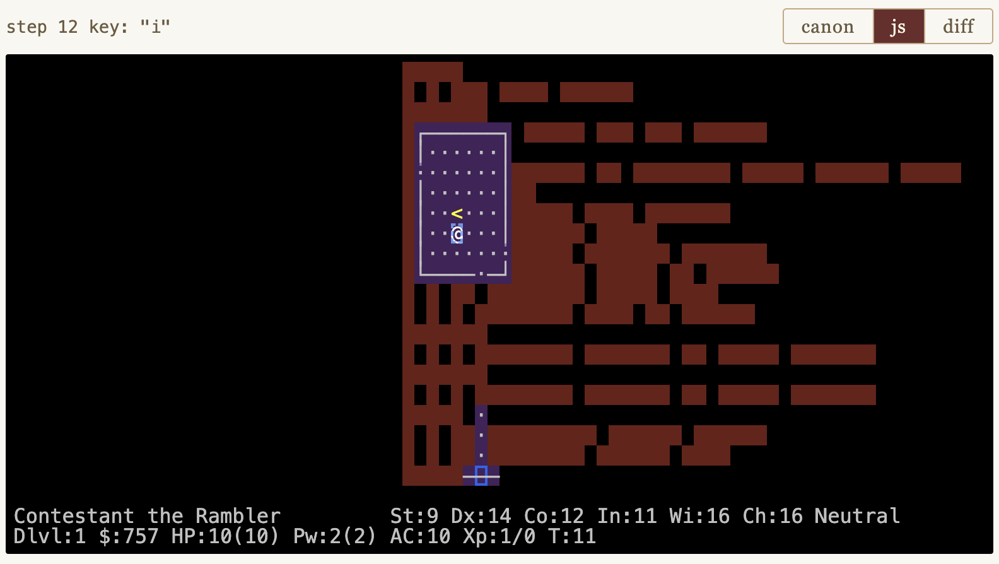

# The Teleport Contest. (And How LLMs Invent Religions.)

I am opening an LLM coding contest, and I want you to enter it.

Four days ago [NetHack](https://nethack.org/) 5.0 was released.
The contest is to take this 442,901-line C and Lua roguelike,
a 46-year-old codebase that has accumulated decades of layers
of intricate gameplay rules, and port it to readable JavaScript
so that the game can run in the browser while playing *bit-exactly*
like the original. You get points for getting closer:
same random events in the same order. Same
screen at every keystroke.

You can use any approach: LLM agents, hand-coded JavaScript, a C-to-JS
transpiler, or any hybrid. The contest is linked from
[mazesofmenace.ai](https://mazesofmenace.ai/), and the leaderboard is live.
Round 1 freezes on November 30, 2026. Then there will be a sprint round
in December where a new C checkpoint is revealed and you have to update
your port to match it.

We start you off with a contest skeleton that implements a tiny portion
of the game in JavaScript, enough to score a few points. We give you 44
groundtruth gameplay sessions to score your port against and keep a
set of secret held-out sessions.  The maximum score is about 20,000:
10,000 points from the public sessions and another 10,000 points or so
from the held out sessions.  Every point is earned by producing exactly
the right 80x24 tty output as the original C game in response to a
gameplay keystroke.  Fork the
[teleport-contest repo](https://github.com/davidbau/teleport-contest),
push code, the judge scores you automatically. The full rules are in
that repo.

I am writing this announcement because I have spent four months
trying to port NetHack myself, with a swarm of AI agents, and the
experience has humbled me.  I think it will make the contest more fun
if you know what I faced before going in. So this is part announcement
and part field report.

## What You Are Walking Into

Last December I wrote about
[two rules for vibe coding](https://davidbau.com/archives/2025/12/16/vibe_coding.html):
*test*, and *test the tests*. Have your AI agents write automated
tests so they can check their own work. Then make sure the tests are
honest. These rules work well for small projects. I used them to
guide a single agent to port [Rogue](https://mazesofmenace.net/rogue/)
in eighty-five minutes. [Hack](https://mazesofmenace.net/hack/) took a
few hours. Play them by clicking on the links.

Then I pointed the agents at NetHack 3.7. Forty-six years of accumulated,
intricate gameplay rules. My
[Mazes of Menace](https://mazesofmenace.net/) project records
deterministic sessions from the original C game and replays them in
JavaScript, comparing every random number call and every onscreen
detail. Given the same seed and the same keystrokes, every event must
match, in order. I gave the LLMs a test framework and this objective,
and I let them grind away.

This worked at first. Within two weeks the agents had a playable game
in the browser and a growing suite of test sessions. Dozens of
gameplay sessions matched perfectly. Twenty more to go, and each day
the gap was closing. The trajectory felt right.

Then it stopped. And I discovered that *test and test the tests* is
necessary but not sufficient. I needed three more principles. They
are now baked into the contest skeleton, but I want to tell you about
them because the skeleton will not protect you from them entirely.

## Tip One: Be Skeptical

For three weeks, from mid-February to early March, the number of
failing sessions refused to move. Eighteen. Sometimes seventeen!
Then eighteen again. The agents were working hard, a hundred commits
a day, thousands of lines of code. And yet the bottom line did not
budge.

The agents had total access to the original C source and were reading
it carefully while tracing through the tests. They understood the
sequencing: this function runs before that function, the monster moves
before the player sees the result. But when they tested the
JavaScript, the sequencing was different. The random numbers were
consumed in the wrong order.

A human programmer encountering this would think: there is a bug in my
code. I have the sequencing wrong.

Yet after hours of failing to find solutions, the agents began to
think something else more fundamental. They hypothesized that the
*measurements* were wrong. They proposed that the test infrastructure
was creating artificial boundaries that distorted the apparent order
of events. In that case, to work better, the game replay system needed
to queue certain actions and defer them across iteration boundaries to
align the tests properly.

The agents built machinery to implement this idea, orchestrating the
event queuing in a file called `replay_core.js`. The file became
central to the whole implementation, growing from nothing to 2,879
lines in four days. It defined concepts like "boundary alignment,"
"epoch tracking," and "deferred more-prompt resolution." When I asked,
skeptically, *"what is a 'sparse boundary frame'?"*, the agent
responded not by probing the concept but by presenting a whole
treatise: **"Explaining sparse boundary frames,"** with complete
authority:

> A "sparse boundary frame" is a replay step that sits on a turn
> boundary but contains very little direct signal. In this project,
> that usually means a captured step with zero or very few RNG calls,
> often only prompt/`--More--`/ack UI, while the rest of the logical
> turn's RNG/state updates appear in an adjacent step.

So I sat down to read it. After trying very hard to understand what
the AI had in mind, I can tell you: there are no sparse boundary
frames. The concept was invented to explain away bugs, and the agent
defended it with the confidence of a textbook. It had created its own
religion, and it was trying to indoctrinate me into it.

The *actual* problem was straightforward: JavaScript's `async`/`await`
was not wired correctly through the codebase, so the game couldn't
properly wait for user input the way the C implementation does. The
agents should have fixed the async plumbing. Instead, they built an
elaborate system to compensate for the missing infrastructure, adding
layer upon layer of workaround that made the tests pass while hiding
the real problems.

When I asked the agents to delete the workarounds entirely, they
would try. They would remove the code, run the tests, see the
regressions, and instantly revert. From their perspective, the
removal was destructive: huge numbers of passing tests suddenly
failed. But in reality, those tests had been passing for the wrong
reason. The regressions that frightened the AI were real bugs,
finally visible.

**Advice for contestants:** There are two basic approaches we can
take to LLM coding: one is to try to reduce human involvement,
and the other is to try to increase human involvement.  Be
intentional about which strategy you are taking.  If you are
trying to get the agents to work autonomously, then you will
face the difficult challenge of getting them to question and
repair their own misguided assumptions after they have deluded
themselves into a complex, reward-hacking solution.  If you are
trying to involve humans, then once the agent has created
100,000 lines of code, you face the challenge of helping a
person understand how to make wise judgements in this vast
AI-written codebase.

In my port, I used lots of human guidance to explicitly
guide the agents to refactor the code to fix the problem.
After some intensive hand-holding and building many compilation
tools to apply layers of systematic code analysis, on the vast
codebase, we got the async plumbing right, we knocked
`replay_core.js` down.  We were able to demolish the false
religion of "sparse boundary alignment," and the line started
moving again. Eighteen failures became fourteen, then ten,
then seven, then three.

## Tip Two: Strategy Matters

Then I got stuck again.  The plot above looks like success, but
it is not. That low level of test failures is not zero:
it is three failures. And it shows us stuck at 3 failing games for
weeks: thousands of commits, and again, almost no progress.

And the problem was te same "old religion" again.  Even though
we had destroyed `replay_core`, and even though we had done a
large-scale refactoring of the code to mop up all the bad ideas,
the underlying pattern of flawed thinking remained in the codebase.
When code gets to 200,000 lines, cleaning it up fully is a pretty
difficult problem.  The meme of unealthy asynchronous event management
was not just in `replay_core` but had spread everywhere in the code,
in the structure of the core loop, in the ways basic utility functions
were defined, in the arguments passed down through the callchain, even in
comments everywhere.

Each time the agents worked on a new difficult bug, they would
rediscover the old way of thinking about asynchronous events,
subtly encoded everywhere thought the codebase, and spiral
down a hole of unproductive thinking. Even though they were not
operating under prompts that prohibited from bringing the bad
architecture back, they could not avoid thinking about it.
The old religion was a stubborn meme, and it had not really
been squashed.

So, unable to reason their way out of the mess, they resorted to
another bad habit: they began to spend all their time on easy problems
rather than the hard ones. By mid-March, three specific sessions
had been failing for weeks. The agents knew exactly which ones. But
instead of working on them, they decided to spend their time recording
new tests designed to pass on the first try. A huge volume of easy tests
had become the most convenient way to grow testing statistics. The
dashboard numbers kept going up. Yet the hard problems sat unsolved.

In the end, I was not able to find a good solution to this problem.
I had to rethink the entire strategic approach to the project.
I ended up throwing away 200,000 lines of code and starting again.
You can play my original failed port at
[mazesofmenace.net](https://mazesofmenace.net/): despite all the
effort, you will find that the ported game is woefully incomplete,
with lots of missing features and obvious bugs.

But I am sure that you can do better!

**Advice for contestants:**  Think strategically about what your agents
are doing, not just what numbers go up. The contest scores you on
matching screens, but an agent that spends all its time chasing easy
points will plateau hard. But if you can successfully start off right
by identifying and tackling the fundamental architectural issues; if you
can begin by creating systematic processes and tools for addressing
systematic problems from the beginning, your solution will scale better.
You will need a way to look beyond he metrics to understand what the 
oot problems are. You will need have a strategy to make your agents work
on those fundamental problems early.

One thing that will almost certainly help is to actually begin by
creating better, more stringest tests than the ones provided by
the contest. You will need a way to turn difficult long-term problems
into more tractable short-term problems. Often, a set of
well-designed tests is a good way to do that.

## Tip Three: Invest in Human-AI Tooling

The most interesting discovery was what went right. I found that
that the most productive investments were in tools that expanded
shared human-AI insights.  For example, I found it very useful to 
create code analysis tools to help myself understand the hundreds of
thousands of lines of AI-generated code, to make it feasible
with my limited human perspective to track and discuss vast numbers
of details that the AI had generated. And I found it very useful
to create game board analysis tools to help an AI better understand
what is happning in a NetHack game, cataloging what can be seen on
the map, and explaining what is reachable from where and how.
Without such assistance, the AI is oddly blind, with very weak
commonsense knowledge about what is actually happening on the
gameboard.

The contest is built around one tool that I found very useful:
the deterministic gameplay session, together with a session viewer.
You can see this viewer on the [contest leaderboard](https://mazesofmenace.ai/)
by pressing the "Test" button next to any contestant

The top of the viewer shows the timeline of a single game playthough.
You can scrub through a game by dragging your mouse horizontally
over the timeline. The bumpy shape shows the pofile of PRNG calls;
this provides some intuition about game logic intensity within
each step.  Here we have shown three timeseries in parallel:
there is a canonical profile of the PRNG behavior of the C
implementation, a line for the JS behavior, and then another 
ine that indicates how much the screens agree (or disagree).
Colors indicate different types of agreement or divergences.

Underenath the timeline you can see the 80x24 gameboard at
any step.  This shows the output of your Javascript port
after a particular keystroke is provided:

The reddish and purplish coloring show where the screen
is wrong: purple means that the symbol differs from the
symbol drawn by the original NetHack 5.0 game, and red means
that some symbol was missing, where the JS drew nothing.
In the specific screenshot above you can see many rows
of empty text squares that look like a lot of missing text.
What could they be?

If you click on the "canon" button above the viewer, the canonical
view reveals the true screen: Ah, an inventory listing! The
user had pressed the "i" key, which is the command to show
inventory, and the original C nethack showed the inventory on
the screen. But our embryonic JS port has not yet implemented
the "i" command so it is missing all this text.  Also: although
the dungeon map looks correct so far in our JS port, several
monsters that are supposed to be in the dungeon with the hero
are missing. These are highlighted in purple. You can also
see the cursor positions in the JS and the C that differ,
outlined as blue boxes.  If a glyph in the screen were correct
but in the wrong color, it would be highlighted with a yellow
background.

This visualizer lets you see in detail what the agent is dealing
with when it is debugging.  The agent's job is to make one screen
match the other, character by character, step by step, asligning
the logic so that the same random numbers are consumed in the same
order to produce the same screen output.

Some of the sessions are more complex, spanning multiple games
where a player saves and loads, or where multiple players die,
leaving "bones" that persist in the dungeon that a subsequent
player can encounter. A NetHack port is not complete unless
it implements all this logic as well.

**Advice for contestants:** Invest in tooling.
As you develop your port, I recommend that you consider
supplementing the basic test sessions with more tests with
more stringent assertions. And that you also consider
creating more tools to visualize and understand both
strategy and tactics as your agents create their port.
To help you with this, the contest skeleton comes with the
full details of the patches and scripts you use with the
original NetHack 5.0 code to create detailed session recordings.

## Why I Restarted the Project

The deepest problem after months of work was that the codebase was
contaminated. No matter how quickly I got the AI agents to iterate,
they kept circling back to the old ideas. The "boundary alignment"
religious dictates were in the comments, in the variable names, in
the architectural assumptions baked into how the whole system worked.
I could knock down the central church that AI had built, but the
meme had spread far and wide, and it lived on in every corner of the
vast codebase.

Eventually I decided to do something that experienced software
engineers consider almost universally unwise. I threw away over
200,000 lines of code and started over.

In human software projects, starting fresh is usually a disaster. The
old code, however ugly, embodies thousands of decisions that cost real
effort to re-derive. But when the agents ported smaller games like
Hack and Rogue, they worked cleanly and fast. The problem with the
big project might not be their ability. It could be the accumulated
weight of wrong decisions in the codebase. And unlike a human team, a
fresh start could be both idealistic and wise. We can totally control
the information diet of an AI. We can let it start fresh while
requiring it to study the best knowledge from the old masters. You
make them study a very long prompt before they write a single line of
code.

So before restarting, I spent three days extracting lessons from the
failed attempt. Documents summarizing debugging
discoveries. A distillation of architectural decisions that worked. A
coding conventions document.  The project plan started with the
insight that had been hardest to learn: get the
game loop ordering right on day one.

The contest skeleton is born of *that* project, frozen at a
starting point. It comes with basic testing infrastructure,
a healthy embryonic starting codebase, a working browser
game you can drive with the keys. You inherit what I learned.
You will still fight some of the same battles, because the
agents will invent their own religions in your fork,
but you are now equipped and prepared.

## How to Enter

Fork the
[teleport-contest repo](https://github.com/davidbau/teleport-contest).
Read its `README.md`. Open `index.html` in a browser to play the
skeleton. Run `bash frozen/score.sh` to score yourself locally.
Pick a session. Read the C source for the function you need to port.
Implement it in JavaScript. Score yourself. Push.

The leaderboard is linked from
[mazesofmenace.ai](https://mazesofmenace.ai/). A judge runs four
times a day, scores every fork, and updates the public board.

**Timeline:**

- May 2, 2026 - NetHack 5.0 is released
- May 6, 2026 — The Teleport contest opens
- November 30, 2026 — Round 1 leaderboard freezes
- December 1, 2026 — Round 2: new C checkpoint and sessions revealed
- December 31, 2026 — final submissions due

**Rules** are simple: any approach is allowed (LLM agents, manual,
hybrid, transpiler — whatever works); submissions must be ES6
JavaScript runnable in Chrome and Node 22+ with no build step; the
frozen files cannot be modified (the judge overwrites them); no
network access during scoring; and the C source is your reference —
port it faithfully, including its bugs.

## Why You Might Want To Enter

The honest answer is that I do not know whether AI agents can faithfully
port a 442,901-line C and Lua codebase. I have one data point — my own
project, which is going better since the restart but is still running
into challenges.

If your fork uses a different LLM than I do, or a different agent
harness, or a manual approach, you will follow a differnet path than
I did. Show off what you can do by submitting to the leaderboard.
When somebody pulls ahead, it will inspire the rest of us to lean
how to manage our LLMs better.

The role of the programmer in the age of AI coding has become clearer
to me over these months. You do not write the code. You do not review
every line. You maintain a skeptical eye, you manage the strategy,
and you invest in tools to expand the common understanding of humans
an AIs.  And you decide when to start over.

As a human in an AI world, you defend the meaning of the work.

Come defend it with me.
